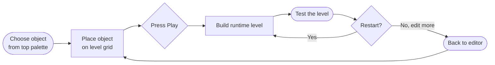
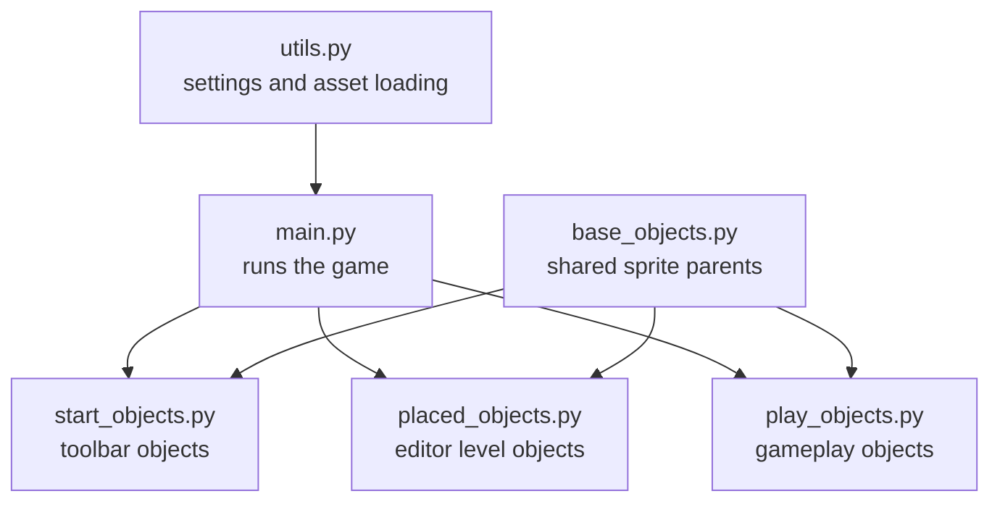
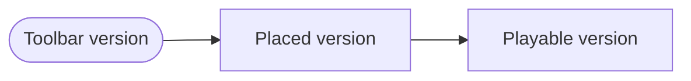
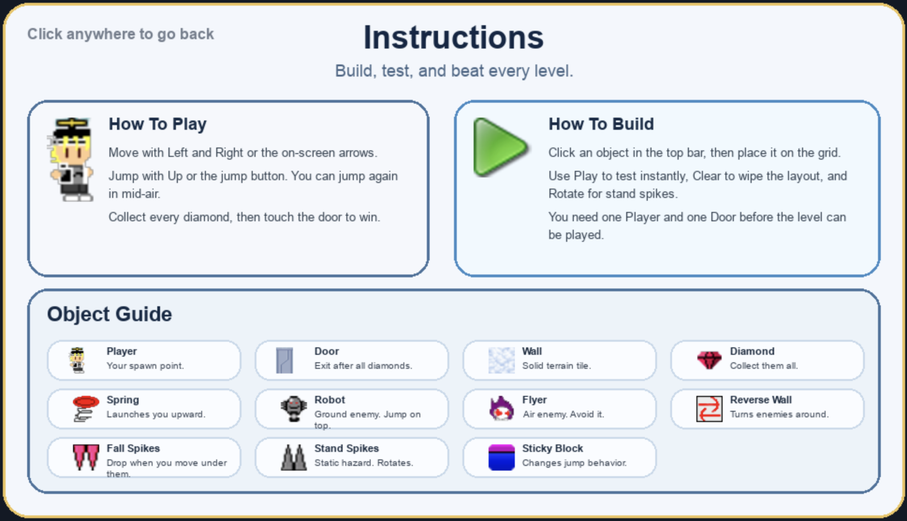

# Propeller Platformer Level Editor

An arcade-style platformer and in-engine level editor built with Python and Pygame.

Design a level, press play, and immediately test the exact layout you just built.

The core loop is simple:

1. Build a level in edit mode.
2. Drop in a player spawn, a goal door, terrain, hazards, and enemies.
3. Switch to play mode instantly to test the level.
4. Collect every diamond, then reach the door to win.

This project is more than a map painter. It contains a full playable platformer with enemy behaviors, hazards, restart logic, mobile-friendly touch controls, and a deliberate architecture split between editor data and runtime gameplay objects.

## Why It Stands Out

- The editor and the game live in the same application
- Levels can be built, tested, and saved as playable level files
- The code separates authoring-time sprites from gameplay-time sprites
- It is small enough to understand, but rich enough to show real game architecture decisions
- It demonstrates how tooling and gameplay can coexist in a single Pygame project

## Demo

<p align="center">
  
</p>

## What The Game Includes

- Edit mode with drag-and-place level construction
- Instant switch between editor and play testing
- Grid-snapped placement inside a bounded build area
- Eraser mode for deleting placed objects
- Rotatable standing spikes
- Restart flow and death counter during play mode
- Mobile accessibility controls for movement and jump
- Bundled sample levels in [`Levels/`](./Levels)

## Built With

- Python
- Pygame
- Sprite-based object architecture
- Grid-based level authoring
- Touch-friendly runtime controls

## Objective

To beat a level, the player must:

1. Collect all diamonds.
2. Reach the door after every diamond has been collected.

If the player hits an enemy or hazard, falls out of bounds, or otherwise dies, the play session restarts from the placed spawn point.

This gives the project a nice designer workflow: build a challenge, hit play, fail quickly, adjust the layout, and try again.

## Game Objects

The editor supports the following level pieces:

- `Player`: the spawn point for the playable character
- `Door`: the exit, which opens only after all diamonds are collected
- `Wall`: solid terrain
- `Reverse Wall`: invisible trigger wall used to reverse enemy direction
- `Diamond`: collectible required for victory
- `Flyer`: horizontal moving enemy
- `Smily Robot`: ground-based enemy with gravity and directional movement
- `Spring`: bounces the player upward
- `Sticky Block`: solid block that changes jump behavior by preventing a normal grounded jump reset pattern
- `Fall Spikes`: spikes that begin falling when the player moves underneath
- `Stand Spikes`: stationary spikes with rotation support

## Controls

### Edit Mode

- Click a palette object across the top to select it
- Click on the grid to place one object
- Click and drag across the grid to paint repeated objects
- Click the same palette item again to deselect it
- Use the eraser button to remove placed objects
- Use the rotate button to rotate standing spikes before placement
- Use the clear button to wipe the current layout
- Use the info button to open the instructions screen
- Use the play button to convert the current edit layout into a playable level

### Play Mode

- Move left and right with the on-screen arrows
- Jump with the jump button
- The player has a double-jump style propeller move
- Press restart to reset the current attempt
- Press the stop button to return to edit mode

### Pause

- Press `Space` to toggle pause

## Installation

### Requirements

- Python 3
- Pygame

The repository currently pins:

```txt
pygame==2.6.1
```

Using a virtual environment is recommended:

```bash
python3 -m venv .venv
source .venv/bin/activate
pip install -r requirements.txt
```

If you prefer not to use a virtual environment, you can still run:

```bash
pip install -r requirements.txt
```

## Running The Project

From the repository root:

```bash
source .venv/bin/activate
python main.py
```

## Bundled Levels

The repo includes several example level files:

- [`Levels/level1.lvl`](./Levels/level1.lvl)
- [`Levels/level2.lvl`](./Levels/level2.lvl)
- [`Levels/level3.lvl`](./Levels/level3.lvl)
- [`Levels/testing.lvl`](./Levels/testing.lvl)

These files store object positions in a Python-literal dictionary format, with keys such as `player`, `door`, `wall`, `flyer`, `diamonds`, and others.

## Current Save / Load Status

The project includes the beginnings of save and load support, and the level format is already present in the `Levels` directory. However, the in-app `save_file()` and `load_file()` functions in [`main.py`](./main.py) are currently stubbed out and commented.

That means:

- The editor/play workflow works
- Bundled `.lvl` files exist as project assets
- Fully wired in-editor save/load is not currently active

## Architecture

This codebase is organized around a very practical split: editor-time objects, play-time objects, and shared base classes.

At a portfolio level, that is the key technical idea in this project. The editor is not just drawing tiles onto the screen. It creates one representation of the world for authoring, then transforms that data into a separate playable simulation.

### Architecture At A Glance



This is the main idea of the whole project: you build a level in the editor, convert it into a playable version, test it, then either restart or go back to editing.



If you are new to the codebase, start with [`main.py`](./main.py). It is the coordinator. The other files mainly define the object types that `main.py` creates and manages.

### High-Level Flow

[`main.py`](./main.py) owns the application loop and most of the orchestration:

- Initializes Pygame, screen, clock, and assets
- Creates the `GameState`
- Runs the main loop
- Switches between edit mode and play mode
- Draws the editor, runtime scene, UI, notifications, and overlays

The most important concept is that the game does not directly play the editor sprites. Instead, it builds a separate runtime version of the level when you press play.

That keeps the editor responsive and simple while letting gameplay objects own their own movement, collision, and restart behavior.

### State Model

[`main.py`](./main.py) defines `GameState`, which acts as the central coordinator for:

- Sprite groups
- Selected editor object
- Drag state
- Eraser state
- Mouse and touch input flags
- Play/edit mode switching
- References to singleton-style objects like the placed player and placed door

This keeps most session-wide logic in one place instead of scattering it across sprites.

For a project of this size, that tradeoff works well. It avoids overengineering while still giving the program one clear source of truth for interaction state.

### Shared Base Classes

[`base_objects.py`](./base_objects.py) provides the inheritance backbone:

- `StartGameObject`: top palette objects shown in the editor UI
- `PlacedObject`: editor-placed level pieces
- `PlayObject`: runtime versions of level pieces used during actual gameplay

This separation is important because the editor and the game need different behavior even when they represent the same thing visually.

### Editor Layer

The editor is primarily built from two concepts:

- Start objects in [`start_objects.py`](./start_objects.py)
- Placed objects in [`placed_objects.py`](./placed_objects.py)

`start_objects.py` contains the top-bar palette versions of objects. These are the pieces the user clicks to select or drag from.

`placed_objects.py` contains the objects that exist in the editable level canvas. These sprites are mostly lightweight containers for position, image, and membership in per-type class lists.

The editor behavior in [`main.py`](./main.py) handles:

- Snap-to-grid placement
- Drag painting across multiple cells
- Object deletion
- Rotation state for spikes
- Single-instance rules for the player and door

In practice, this makes the editor feel closer to a level-painting tool than a one-object-at-a-time placer.

### Runtime Layer

When the user enters play mode, `GameState.switch_to_play_mode()` in [`main.py`](./main.py) converts the placed editor objects into runtime objects from [`play_objects.py`](./play_objects.py).

This is one of the strongest design choices in the project:

- Edit-time data stays simple
- Play-time sprites carry movement, collision, restart, scoring, and animation logic
- Returning to edit mode can cleanly destroy the runtime layer without damaging the editor layout

That conversion step is the architectural center of the project.



The same idea shows up across the codebase: one object type can have an editor version and a separate gameplay version.

### Per-Type Object Lists

Many sprite classes maintain class-level lists such as:

- `PlacedWall.wall_list`
- `PlayWall.wall_list`
- `PlayFlyer.flyer_list`
- `PlayDiamonds.diamonds_list`

This pattern is used heavily for:

- Collision checks
- Restarting objects
- Destroying all objects of a given type
- Converting editor objects into runtime objects
- Exporting object positions into level dictionaries

It is a simple but effective alternative to a more formal ECS or scene graph.

For a compact Pygame codebase, this choice keeps collision logic readable and avoids adding framework complexity that would outweigh the benefits.

### Player And Gameplay Logic

[`play_objects.py`](./play_objects.py) contains most of the game rules:

- `PlayPlayer` handles gravity, movement, jumping, propeller-assisted second jump, collision, facing direction, score, and death count
- `PlayDoor` opens only when the player has collected all diamonds
- `PlayFlyer` patrols horizontally and reverses on collisions
- `PlaySmilyRobot` uses gravity plus horizontal roaming and can be stomped from above
- `PlayFallSpikes` activate when the player moves underneath them
- `PlaySpring` launches the player upward

Gameplay resolution during play mode is coordinated by `play_mode_function()` in [`main.py`](./main.py), which checks:

- Player movement inputs
- Hazards and enemy collisions
- Diamond collection
- Door win condition
- Restart triggers

Together, these systems make the project feel like a real game rather than just an editor prototype.

### UI Layer

[`ui.py`](./ui.py) contains button sprites for editor and play interactions, including:

- Clear
- Info
- Eraser
- Restart
- Grid
- Save / load buttons

`main.py` adds the higher-level interactive behavior on top of these sprites.

### Asset Loading

[`utils.py`](./utils.py) contains shared constants and asset-loading helpers:

- Screen dimensions
- FPS
- Global image and sound registries
- `load_image()`
- `load_sound()`
- `load_font()`

`load_all_assets()` in [`main.py`](./main.py) uses these helpers to register all runtime art and audio before the game loop starts.

### Restart And Reset Pipeline

The reset flow is split into three clear functions in [`main.py`](./main.py):

- `remove_all_placed()` clears the editor canvas
- `remove_all_play()` destroys runtime play-mode objects
- `restart_level()` resets runtime objects back to their original placed positions

That distinction makes it possible to:

- wipe a level from the editor,
- restart a play session without losing the layout,
- and switch cleanly back from play mode to edit mode.

## Project Structure

```text
LevelEditor/
├── main.py            # Main loop, GameState, edit/play orchestration
├── base_objects.py    # Shared sprite base classes
├── start_objects.py   # Top palette/editor source objects
├── placed_objects.py  # Objects placed into the editable level
├── play_objects.py    # Runtime gameplay objects and behaviors
├── ui.py              # Button sprites and simple UI elements
├── utils.py           # Constants and asset loading helpers
├── Levels/            # Bundled sample level data
├── Sprites/           # Game art and UI art
├── Sounds/            # Music and sound effects
└── Docs/              # Demo media and instruction images
```

## Notes And Limitations

- The codebase currently centralizes a large amount of orchestration in `main.py`
- Save/load UI exists, but the implementation is intentionally unfinished right now
- Runtime behavior depends on class-level object lists rather than a data-driven entity system
- The project is designed around a fixed screen size of `1024x600`
- The build area is constrained by UI boundaries and grid offsets defined in `GameState`

## Why This Project Is Interesting

This project is a strong example of a small game toolchain living inside the game itself.

It combines:

- level editing,
- runtime conversion,
- platforming mechanics,
- enemy logic,
- and playtesting

inside a single Pygame application.

For anyone studying game programming, it is especially useful as a readable example of how to separate editor-time data from runtime simulation without introducing a heavy engine architecture.

It also shows a good instinct for project scope: the game is ambitious enough to be interesting, but constrained enough to stay understandable.

## Screenshot


